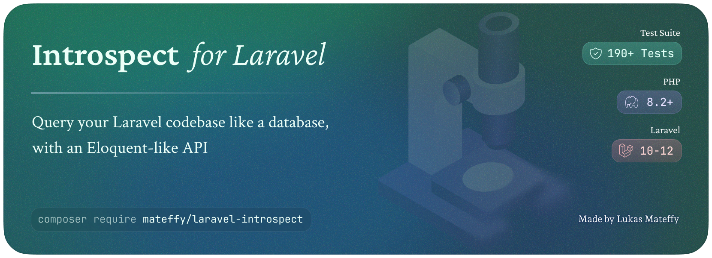

# Introspect for Laravel

A utility library to analyze and pull information from Laravel codebases, querying model, route and more Laravel-specific things directly from your codebase using PHP reflection.  
It is targeted for development tools and coding agents for better understanding of the codebase.

## Who is this for?  
  
Are you building a devtool or other application that needs to introspect a Laravel codebase?  
Then this package will make your life a lot easier by providing a fluent API to query models, routes, controllers, views and more.

<br />

- Query views, routes, classes and models with a fluent API
- Parse properties, relationships + their types and more from Eloquent models
- (De-)serialize queries to/from JSON (for LLM Tools)

<br />

| Query      | Available Filters                                                      |
|------------|------------------------------------------------------------------------|
| Views      | name, path, used by view, uses view, extends                           |
| Routes     | name, URI, controller + fn, methods, middleware                        |
| Classes    | name / namespace, extends parent, implements interfaces, uses traits   |
| ⤷ Models   | ... relationships, properties, casts, fillable, hidden, read/writeable |
| ⤷ Commands | ... signature, description                                             |
  
> Name and a few other queries even support wildcard queries (e.g. `components.*.paragraph`)

<br />

## Installation  
  
Install the package via composer:  
  
```bash  
composer require mateffy/laravel-introspect  
```  

> [!NOTE]  
> The package is still in development and not tagged, you will be installing the `dev-main` branch for now.
  
<br />

## Usage  
  
```php  
use Mateffy\Introspect\Facades\Introspect;  

$views = Introspect::views()
    ->whereNameEquals('components.*.button')
    ->whereUsedBy('pages.admin.*')
    ->get();  
    
$routes = Introspect::routes()
    ->whereUsesController(MyController::class)
    ->whereUsesMiddleware('auth')
    ->whereUsesMethod('POST')
    ->get();  

$classes = Introspect::classes()
    ->whereImplements(MyInterface::class)
    ->whereUses(MyTrait::class)
    ->get();  
    
$models = Introspect::models()
    ->whereHasProperties(['name', 'email'])
    ->whereHasFillable('password')
    ->get();  

// Access Eloquent properties, relationships, casts, etc. directly
$detail = Introspect::model(User::class);

// Model to JSON schema
$schema = $detail->schema();
```  

- [Views](#views)
- [Routes](#routes)
- [Classes](#generic-classes)
- [Models](#models)
- [Commands](#commands)
- [Chaining queries with OR and AND](#chaining-orand)

<br />

### Views  

You can query all of the views you have in your codebase, including those that are provided by other packages and are namespaced with a `prefix::`.
View queries return a `Collection<string>` of view names.

> All queries support wildcards, e.g. `components.*.button` or `*.button`

#### Query views by view path  
```php  
$views = Introspect::views()  
    // Supports wildcards 
    ->whereNameEquals('*components.*item')
    ->get();
// -> ['components.item', 'filament::components.dropdown.list.item', ...]
    
$views = Introspect::views()  
    ->whereNameStartsWith('filament::')
    ->get();  

$views = Introspect::views()  
    ->whereNameEndsWith('button')
    ->get();  

$views = Introspect::views()  
    ->whereNameContains('button')
    ->get();
```  

#### Query all views that are used by specific views  
```php  
$routes = Introspect::views()  
    ->whereUsedBy('pages.welcome')
    ->get();
// -> ['components.button', 'filament::components.button', ...]
    
$routes = Introspect::views()  
    ->whereUsedBy('pages.*')
    ->get();
    
$routes = Introspect::views()  
    ->whereNotUsedBy('pages.*')
    ->get();
```  
  
#### Query all views that use a specific view  
```php  
$routes = Introspect::views()  
    ->whereUses('components.button')   
    ->get();
    
$routes = Introspect::views()  
    ->whereUses('*.button')   
    ->get();
    
$routes = Introspect::views()  
    ->whereDoesntUse('*.button')   
    ->get();
```  

#### Query all views that extend a specific view  

```php  
$routes = Introspect::views()  
    ->whereExtends('layouts.app')   
    ->get();
    
$routes = Introspect::views()  
    ->whereExtends('layouts.*')   
    ->get();
    
$routes = Introspect::views()  
    ->whereDoesntExtend('layouts.*')   
    ->get();
```

<br />

### Routes

Query through all the routes registered in your application (think like `artisan route:list` output), including those registered by packages.
The routes are returned as a `Collection<\Illuminate\Routing\Route>`.

#### Query all routes that use a controller  
```php  
$routes = Introspect::routes()  
    ->whereUsesController(MyController::class)  
    ->get();
// -> [\Illuminate\Routing\Route, \Illuminate\Routing\Route, ...]

$routes = Introspect::routes()  
    ->whereUsesController(MyController::class, 'index')
    ->get();
    
$routes = Introspect::routes()  
    ->whereUsesController(SingleActionController::class, 'index')
    ->get();
```  

#### Query all routes that use a specific middleware  
```php  
$routes = Introspect::routes()  
    ->whereUsesMiddleware(MyMiddleware::class)  
    ->get();

$routes = Introspect::routes()  
    ->whereUsesMiddlewares(['tenant', 'auth'])  
    ->get();
    
$routes = Introspect::routes()  
    // Match any of the middlewares
    ->whereUsesMiddlewares(['tenant', 'auth'], all: false)
    ->get();
    
$routes = Introspect::routes()  
    ->whereDoesntUseMiddleware('api')  
    ->get();
```  

#### Query routes by name
> "Name equals/contains" queries support wildcards, e.g. `api.products.*` or `*.products.*`  

```php  
$routes = Introspect::routes()  
    ->whereNameEquals('api.products.*')
    ->get();
    
$routes = Introspect::routes()  
    ->whereNameStartsWith('api.products.')
    ->get();

$routes = Introspect::routes()  
    ->whereNameEndsWith('api.products.')
    ->get();
    
$routes = Introspect::routes()  
    ->whereNameDoesntEqual('api.products.*')
    ->get();
```  

#### Query routes by path
> "Path equals/contains" queries support wildcards, e.g. `api/products/*` or `*/products/*`  

```php  
$routes = Introspect::routes()  
    ->wherePathStartsWith('api/products')
    ->get();

$routes = Introspect::routes()
    ->wherePathEndsWith('products')
    ->get();

$routes = Introspect::routes()
    ->wherePathContains('products')
    ->get();

$routes = Introspect::routes()
    ->wherePathEquals('api/products*')
    ->get();
```

<br />

### Generic Classes

#### Query by namespace
```php
$services = Introspect::classes()  
    ->whereName('\App\Services')
    ->get();
```

#### Query by parent
```php
$blocks = Introspect::classes()  
    ->whereExtends(CMS\Block::class)
    ->get();
```

#### Query by interface
```php
$blocks = Introspect::classes()  
    ->whereImplements(CMS\Block::class)
    ->get();
```

#### Query by trait
```php
$blocks = Introspect::classes()  
    ->whereUses(MyTrait::class)
    ->get();
```

<br />

### Models
#### Query by relationship
```php  
$models = Introspect::models()  
    ->whereRelationship('users')  
    ->get();

$models = Introspect::models()  
    ->whereRelationship('users', HasMany::class)  
    ->get();

$models = Introspect::models()  
    ->whereRelatesTo(User::class)  
    ->get();

$models = Introspect::models()  
    ->whereRelatedTo(User::class)  
    ->get();

$models = Introspect::models()  
    ->whereHasProperty('name')  
    ->get();

$models = Introspect::models()  
    ->whereDoesntHaveProperty('name')  
    ->get();

$models = Introspect::models()  
    ->whereSetter('name')  
    ->get();
    
$models = Introspect::models()  
    ->whereFillable('name')  
    ->get();

$models = Introspect::models()  
    ->whereNotFillable('name')  
    ->get();

$models = Introspect::models()  
    ->whereGuarded('name')  
    ->get();

$models = Introspect::models()  
    ->whereNotGuarded('name')  
    ->get();

$models = Introspect::models()  
    ->whereGetter('name')  
    ->get();

$models = Introspect::models()  
    ->whereSetter('name')  
    ->get();
    
$models = Introspect::models()  
    ->whereSetter('name')  
    ->get();

$models = Introspect::models()  
    ->whereHidden('name')  
    ->get();

$models = Introspect::models()  
    ->whereNotHidden('name')  
    ->get();
    
$models = Introspect::models()  
    ->whereCast('name')
    ->get();

$models = Introspect::models()  
    ->whereDoesntCast('name')
    ->get();
    
$models = Introspect::models()  
    ->whereCast('is_admin', 'boolean')
    ->get();
    
$models = Introspect::models()  
    ->whereCastWith(CustomCoordinateCast::class)
    ->get();
```

<br />

### Chaining queries with `OR` and `AND`

By default, any queries are combined with `AND` logic.
However, you can craft more complex queries by chaining together queries with `OR` logic, too.
This works for all queries, including models, routes, views and classes.

```php
use \Mateffy\Introspect\Query\Contracts\RouteQueryInterface;

$routes = Introspect::routes()  
    ->whereNameEquals('api.*')
    ->whereMethod('POST')
    ->or(fn (RouteQueryInterface $query) => $query
        ->whereHasParameter('product') //
        ->whereHasParameter('category')
    )
    ->get();
```

Some methods support multiple parameters, e.g. `whereUsesMiddlewares([...])` or `whereUsesProperties([...])`.
These methods have an `all` parameter that defaults to `true`. If set to `false`, the values are checked with `OR` logic too, matching on any of the values.

```php
$routes = Introspect::routes()  
    ->whereUsesMiddlewares(['tenant', 'auth'], all: false)  
    ->get();
```

<br />

### Limit the results and paginate just like using Eloquent queries
_Actual Laravel pagination (`->paginate(...)`) is not yet supported, but you can use `limit` and `offset` to get the results you want._  

```php  
$models = Introspect::models()  
    ->limit(10)
    ->offset(20)
    ->get();
```  

<br />
  
### Build Queries with JSON instead of code  
  
All the type-safe queries above can also be expressed in JSON format.  
This is to make it easier for LLMs to be able to more flexibly query the codebase.  
  
```php  
$query = <<<JSON
{
    "type": "models",
    "query": {
        "filters": [
            {
                "type": "whereTrait",
                "value": "MyTrait::class"
            }
        ],
        "limit": 10,
        "offset": 20
    }
}
JSON;

$models = Introspect::query($query)->get();
```  
  
<br />

## DTO Examples

#### Get all model properties
```php
$model = Introspect::model(User::class);
$properties = $models->properties();
$casts = $models->casts();
$casts = $models->casts();
```

#### Get Model as JSON schema
```php
$schema = Introspect::model(User::class)->schema();
// -> ['type' => 'object',...]
```

<br />
  
## License  
  
The MIT License (MIT). Please see [License File](LICENSE.md) for more information.
